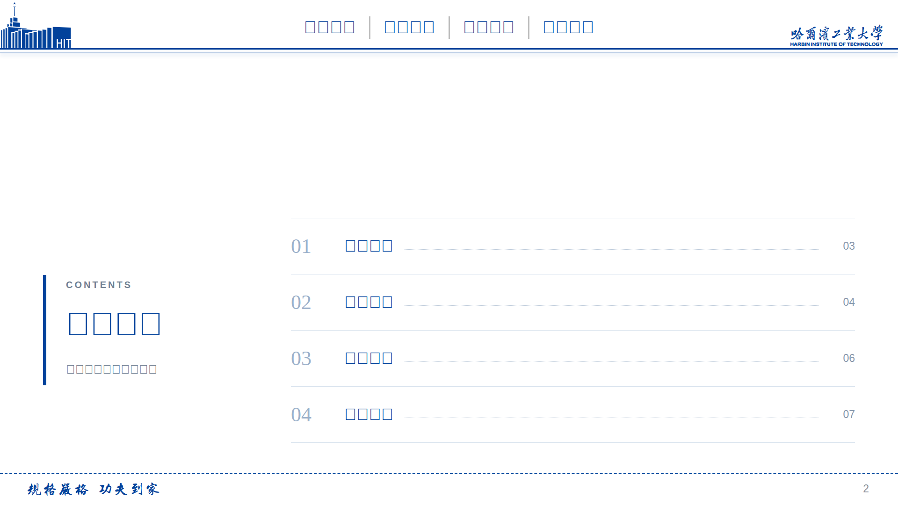
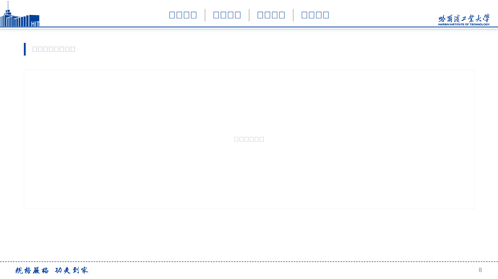

# HIT-PowerPoint-html

**哈尔滨工业大学学术汇报 HTML 模板**

[点击预览](https://dsqsqblxhq.github.io/HIT-PowerPoint-html/HIT-HTML.html) · [下载文件](https://github.com/DSQsqblxhq/HIT-PowerPoint-html/releases/download/v1.0.0/HIT-HTML.html)

本项目为个人整理，与哈尔滨工业大学官方发布渠道无隶属关系。原 PPT 及其他参考资料的来源、署名和许可范围见 [来源与第三方说明](docs/THIRD_PARTY_NOTICES.md)。

## 预览

<table>
  <tr>
    <td align="center">
      
       
      目录页
    </td>
    <td align="center">
      
       
      母版页
    </td>
  </tr>
</table>

## 快速开始

- **在线预览**：直接访问 [HIT-PowerPoint-html](https://dsqsqblxhq.github.io/HIT-PowerPoint-html/HIT-HTML.html)。
- **本地使用**：下载[HIT-HTML.html](https://github.com/DSQsqblxhq/HIT-PowerPoint-html/releases/download/v1.0.0/HIT-HTML.html)，用浏览器打开。
- **编辑模板**：用文本编辑器修改标题、正文、讲稿，保存后刷新浏览器。

日常使用可以只修改 HTML 文件，转交或再分发时请同时保留相关来源与许可说明。

## 功能

| 功能 | 说明 |
|------|------|
| 单文件离线放映 | 样式、脚本、SVG 资源全部内嵌 |
| 16:9 固定画布 | 1920×1080，自动缩放 |
| 8 页初始模板 | 封面、目录、章节页、正文、双栏、表格、结束页、空白母版 |
| 讲稿侧栏 | 与当前页面同步，支持建议时长和文献引用 |
| 排练计时 | 开始、暂停、继续、重置 |
| 打印样式 | 可通过浏览器打印或另存为 PDF |

## 操作速查

| 操作 | 按键或入口 |
| --- | --- |
| 下一页 | `→` / `↓` / `PageDown` / 空格 |
| 上一页 | `←` / `↑` / `PageUp` |
| 第一页 / 最后一页 | `Home` / `End` |
| 全屏 / 退出全屏 | `F` 或底部“全屏”按钮 |
| 打开 / 关闭讲稿 | `N` 或底部“讲稿”按钮 |
| 关闭讲稿面板 | `Esc` 或面板“关闭”按钮 |
| 返回目录 | 底部“目录”按钮 |
| 打印 / 导出 PDF | 底部“打印”按钮 |

将鼠标移至窗口底部可显示放映控制栏。触屏横向滑动可翻页。关闭讲稿面板后，已开始的排练计时仍会继续；刷新页面会重置计时。

## 修改模板

主要编辑位置：

| 内容 | HTML 中的位置 |
| --- | --- |
| 题目、姓名、单位和日期 | 封面与结束页的 `cover-meta` 和标题 |
| 页面正文 | 各个 `section.slide` |
| 章节名称和跳转页码 | `CONFIG.sections` |
| 页面所属章节 | `data-section` 属性 |
| 逐页讲稿和建议时长 | `NOTES` 数组 |
| 主色、画布尺寸和正文字体 | `:root` 中的 CSS 变量 |

复制、删除或移动页面后，请同步检查 `CONFIG.sections` 的目标页码及 `NOTES` 的条目顺序。初始第 8 页为空白母版，会进入打印结果；正式汇报前可删除不用的页面。

完整编辑说明见 [使用指南](docs/USAGE.md)。模板中的文字、人员信息和实验数据均为占位内容，请替换后使用。

## 来源与许可

- 灵感来源：[yhao-z/HIT-PowerPoint](https://github.com/yhao-z/HIT-PowerPoint)
- 本仓库代码（HTML/CSS/JS）：[MIT](./LICENSE)
- 第三方代码与素材：
  - `fs-notebook-tabs` 组件：MIT 许可证，详见 [licenses/open-design-fs-notebook-tabs-MIT.txt](./licenses/open-design-fs-notebook-tabs-MIT.txt)

原 PPT 仓库注明其模板基于哈工大 PPT 大赛的“三生万物”模板制作，原作者身份及原始公众号链接尚未补全。
本项目保留该来源记录，并感谢原模板作者、yhao-z 和 Open Design 相关贡献者。

本仓库暂不对全部文件声明统一开源许可证。随附 MIT 许可仅对应 Open Design 的 `fs-notebook-tabs` 参考示例，不扩展至 PPT 设计、学校标识、字形素材或本项目全部内容。
各项具体说明见 [THIRD_PARTY_NOTICES.md](docs/THIRD_PARTY_NOTICES.md)。

如果你是相关作品的权利人，或掌握原始作者及授权资料，欢迎通过仓库 Issue 补充，便于完善署名和使用说明。
